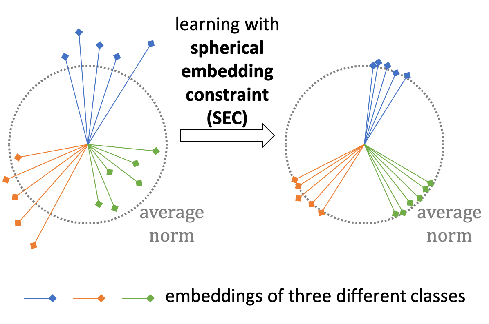
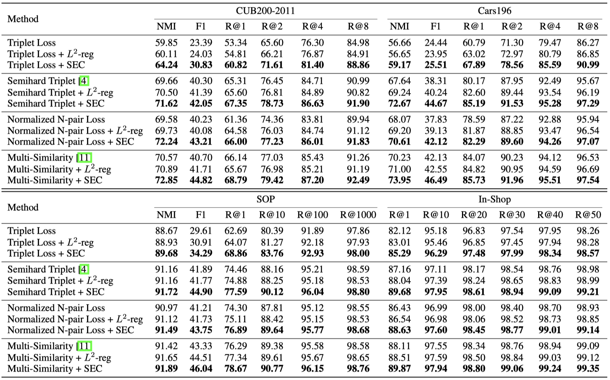

# SphericalEmbedding

This repository is the official implementation of [Deep Metric Learning with Spherical Embedding](https://arxiv.org/abs/2011.02785) on deep metric learning (DML) task. 

>📋  Training a vanilla triplet loss / semihard triplet loss / normalized N-pair loss (tuplet loss) / multi-similarity loss on CUB200-2011 / Cars196 / SOP / In-Shop datasets.

<div align=center></div>


## Requirements

This repo was tested with Ubuntu 16.04.1 LTS, Python 3.6, PyTorch 1.1.0, and CUDA 10.1. 

Requirements: torch==1.1.0, tensorboardX

## Training

1. Prepare datasets and pertained BN-Inception.

   Download datasets: [CUB200-2011](http://www.vision.caltech.edu/visipedia/CUB-200-2011.html), [Cars196](https://ai.stanford.edu/~jkrause/cars/car_dataset.html), [SOP](https://cvgl.stanford.edu/projects/lifted_struct/), [In-Shop](http://mmlab.ie.cuhk.edu.hk/projects/DeepFashion/InShopRetrieval.html), unzip and organize them as follows.

```
└───datasets
    └───split_train_test.py
    └───CUB_200_2011
    |   └───images.txt
    |   └───images
    |       └───001.Black_footed_Albatross
    |       └───...
    └───CARS196
    |   └───cars_annos.mat
    |   └───car_ims
    |       └───000001.jpg
    |       └───...
    └───SOP
    |   └───Stanford_Online_Products
    |       └───Ebay_train.txt
    |       └───Ebay_test.txt
    |       └───bicycle_final
    |       └───...
    └───Inshop
    |   └───list_eval_partition.txt
    |   └───img
    |       └───MEN
    |       └───WOMEN
    |       └───...
```

​		Then run ```split_train_test.py``` to generate training and testing lists.

​        Download the imagenet pertained [BN-Inception](http://data.lip6.fr/cadene/pretrainedmodels/bn_inception-52deb4733.pth) and put it into ```./pretrained_models```.

2. To train the model(s) in the paper, run the following commands or use ```sh mytrain.sh```.

   Train models with vanilla triplet loss.

```train
CUDA_VISIBLE_DEVICES=0 python train.py --use_dataset CUB --instances 3 --lr 0.5e-5 --lr_p 0.25e-5 \
--lr_gamma 0.1 --use_loss triplet
```

​		Train models with vanilla triplet loss + SEC.

```train
CUDA_VISIBLE_DEVICES=0 python train.py --use_dataset CUB --instances 3 --lr 0.5e-5 --lr_p 0.25e-5 \
--lr_gamma 0.1 --use_loss triplet --sec_wei 1.0
```

​        Train models with vanilla triplet loss + L2-reg.

```train
CUDA_VISIBLE_DEVICES=0 python train.py --use_dataset CUB --instances 3 --lr 0.5e-5 --lr_p 0.25e-5 \
--lr_gamma 0.1 --use_loss triplet --l2reg_wei 1e-4
```

​		Similarly, we set ```--use_loss``` to ```semihtriplet```/```n-npair```/```ms``` and ```--instances``` to ```3```/```2```/```5```, for training models with semihard triplet loss / normalized N-pair loss / multi-similarity loss. We set ```--use_dataset``` to ```Cars```/```SOP```/```Inshop```, for training models on other datasets.

>📋  The detailed settings of the above hyper-parameters is provided in Appendix B of our paper (with two exceptions to the lr settings listed below). 
>
>(a) multi-similarity loss without SEC/L2-reg on CUB: 1e-5/0.5e-5/0.1@3k, 6k
>
>(b) multi-similarity loss without SEC/L2-reg on Cars: 2e-5/2e-5/0.1@2k
>
>(We find that using a larger learning rate harms the original loss function.)
>
>When training on a different dataset or with a different loss function, we only need to modify the hyper-parameters in above commands and the head settings (only when using multi-similarity loss without SEC/L2-reg, we need to set need_bn=False,
>
>```
>self.model = torch.nn.DataParallel(BNInception(need_bn=False)).cuda()
>```
>
>in line 24 of learner.py).

>📋  Additionally, to use SEC with EMA method, we need to set ```--norm_momentum <value>```, where norm_momentum denotes $\rho$ in Appendix D of our paper.

## Testing

The test of NMI and F1 on SOP costs a lot of time, and we thus conduct it only after the training process (we only conduct test of R@K during training). In particular, run:

```eval
CUDA_VISIBLE_DEVICES=0 python test_sop.py --use_dataset SOP --test_sop_model SOP_xxxx_xxxx
```

or use ```sh test_sop.sh``` for a complete test of NMI, F1, and R@K on SOP. Here ```SOP_xxxx_xxxx``` is the model to be tested which could be found in ```./work_space```.

For other three datasets, the test of NMI, F1, and R@K is conducted during the training process.

## Results

Our model achieves the following performance on CUB200-2011, Cars196, SOP, and In-Shop datasets:

<div align=center></div>

## Citation

If you find this repo useful for your research, please consider citing this paper

    @article{zhang2020deep,
      title={Deep Metric Learning with Spherical Embedding},
      author={Zhang, Dingyi and Li, Yingming and Zhang, Zhongfei},
      journal={arXiv preprint arXiv:2011.02785},
      year={2020}
    }
